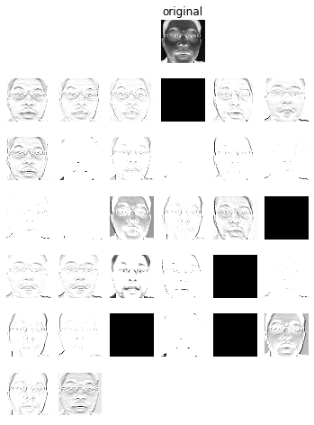
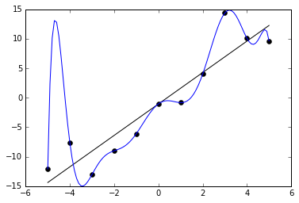

# Convolutional Neural Networks
A convolutional neural network, or convnet, is a type of feed-forward artifcial neural network that is used to process grid structured data, for example 2D images, and time series data. Convnets obtain their name from the fact that they use convolution instead of matrix mutiplication on at least one of its layers. Convolutional neural networks are currently the best techniques for image and sound processing.


<font size="2"><center>Image taken from the <a href='http://ufldl.stanford.edu/tutorial/supervised/ConvolutionalNeuralNetwork/'>Stanford convolutoinal network tutorial</a></center></font>

The basic building block of convolutional neural networks are convolutional layers. A convolutional layer is defined by a set of filters, which are then applied to the input image to produce an output.

In the above image neurons of the same color are the same filter, there are several neurons with the same color because the filter is applied to the whole image. Each filter creates an output of size WxHx1 called a feature map. The feature maps from all the filters are then stacked together to construct a WxHxF output volume, where F is the amount of filters in the layer. 

The input to a convolutional layer is also a volume. The input volume is of size WxHxD where W is the width dimension of the input, H is the height dimension and D is the feature dimension. In the above image there is a single feature dimension, and it represents the greyscale value of the pixel. 

Given that convolutional layers both take an volume as an input, and give an volume as an output they can be stacked one after another, and this is the general architecture of a convolutional neural network. In practice however, convnets include also pooling layers, and fully connected layers.

If we used filters that spanned the entirety of the input image, our convnet would be equivalent to a normal fully connected network.

## Sparse connectivity


<font size="2"><center>Image taken from the <a href='http://deeplearning.net/tutorial/mlp.html'>DeepLearning.net MLP tutorial</a></center></font>

In traditional multi-layer perceptrons as shown above, all layers are fully connected to the next layer. This means that a network in which the input layer has **100x100** neurons, and the second layer has **64** neurons will require **640000** weights.


<font size="2"><center>Image taken from the <a href='http://deeplearning.net/tutorial/lenet.html'>DeepLearning.net LeNet tutorial</a></center></font>
 
On the other hand convnets are sparsely connected, meaning that each neuron in a layer is only connected to a subset of the previous layer. Using the same example as above, a network with **100x100** input neurons and with **64** neurons on the following layer would only need **64xK** weights, where **K** is the filter size. Filters are usually small, 2x2, 3x3 5x5, etc.

## Weight sharing


<font size="2"><center>Image taken from the <a href='http://deeplearning.net/tutorial/lenet.html'>DeepLearning.net LeNet tutorial</a></center></font>

A convolutional layer is composed of several sets of neurons, where each set is restricted to having the same weights. In the image above layer m is composed of a set of weights for all three neurons, same color lines represent same weights. Each neuron above can be though of as applying a 1x3 filter, and producing a 1x1 output. When we consider the three neurons together, they apply the same 1x3 filter on three different locations of the image and produce a 1x3 feature map.

In practice, convolutional layers usually have several of these sets, and each set produces its own feature map. 

## Convolution

A convolution is mathematical operation of two functions that produces a a third function, which can be viewed as a modification of one of the original functions.
A discrete convolution is defined as $$(f * g)[i]=\sum_{m=0}^{i-1}f[m]g[i-m]$$
Then the two dimentional discrete convolution is $$(f * g)[i, j]=\sum_{m=0}^{i-1}\sum_{n=0}^{j-1}f[m, n]g[i-m, j-n]$$
In the case of a convnet $g[i,j]$ represents the input at location i,j, while $f[i,j]$ represents the kernel weights connected to the input at location i, j.

## Pooling


<font size="2"><center>Animation taken from the <a href='http://deeplearning.stanford.edu/tutorial/'>Stanford deep learning tutorial</a></center></font>

In adition to convolutional layers, convnets usually have pooling layers. Pooling is performing a operation, usually taking the maximum, on a subset of the image at a time creating a feature map. Pooling layers serve two main purposes, one is to provide some translational invariance of features, and the other is to reduce the dimentionality of the layers.

The translational invariance comes from the fact that pooling assigns a single value to a a subset of the input. For example if we have a 5x5 max pooling neuron and the maximum value its on the top left corner of its input, if the input is translated to the right by four units the pooling neuron will still give the same output.

The dimentionality reduction play a big role in keeping convnets tractable, for example a 2x2 max pooling layer will reduce the size of its input by a factor of 2x2 = 4.


```python
%matplotlib inline

import util
from nolearn.lasagne import visualize
import numpy as np
```

    DEBUG: nvcc STDOUT mod.cu
       Creating library C:/Users/erpa_/AppData/Local/Theano/compiledir_Windows-10-10.0.14295-Intel64_Family_6_Model_60_Stepping_3_GenuineIntel-3.4.4-64/tmp3cbxfn57/m91973e5c136ea49268a916ff971b7377.lib and object C:/Users/erpa_/AppData/Local/Theano/compiledir_Windows-10-10.0.14295-Intel64_Family_6_Model_60_Stepping_3_GenuineIntel-3.4.4-64/tmp3cbxfn57/m91973e5c136ea49268a916ff971b7377.exp
    
    Using gpu device 0: GeForce GTX 980 Ti (CNMeM is disabled, cuDNN 5004)


To better visualize how convolution works, and what kinds of filters are learned we will disect a fully trained convnet with over 8 million parameters trained in the task of detecting facial features. The network architecture is taken from [Daniel Nouri](http://danielnouri.org/notes/2014/12/17/using-convolutional-neural-nets-to-detect-facial-keypoints-tutorial/) and trained for ten hours on kaggle's [facial keypoint detection data](https://www.kaggle.com/c/facial-keypoints-detection).

The network is created using Lasagne, a python wrapper around Theano.

The network is composed of three alternating convolution and max-pooling layers, followed by two fully connected layers. The network is trained on about 2000 96x96 black and white images, and outputs the x and y location of 15 different facial keypoins. For example left_eye_center, right_eye_center, nose_tip, mouth_center_bottom, etc.

Below is the definition of the network used here. Some details of the network, such as dropout, input augmentation, etc. have been ommitted for clarity.


```python
from nolearn.lasagne import NeuralNet
from lasagne.layers import InputLayer, Conv2DLayer, MaxPool2DLayer, DenseLayer

convnet = NeuralNet(
            layers=[
                ('input', InputLayer),
                ('conv1', Conv2DLayer),
                ('pool1', Conv2DLayer),
                ('conv2', Conv2DLayer),
                ('pool2', MaxPool2DLayer),
                ('conv3', Conv2DLayer),
                ('pool3', MaxPool2DLayer),
                ('hidden4', DenseLayer),
                ('hidden5', DenseLayer),
                ('output', DenseLayer),
            ],
            input_shape=(None, 1, 96, 96),
            conv1_num_filters=32, conv1_filter_size=(3, 3), pool1_pool_size=(2, 2),
            conv2_num_filters=64, conv2_filter_size=(2, 2), pool2_pool_size=(2, 2),
            conv3_num_filters=128, conv3_filter_size=(2, 2), pool3_pool_size=(2, 2),
            hidden4_num_units=1000,
            hidden5_num_units=1000,
            output_num_units=30, output_nonlinearity='none',
            regression=True,
    )
```

First we load the fully trained network. It trained for 3000 epochs, which took around 10 hours on my GTX 570.


```python
net = util.unpickle_network("../networks/n7.pkl")
util.visualize_predictions(net)
```


As can be shown above, the network does a very good job of locating the 15 different facial keypoints. In order to understand how the network does this, we will open it up and see how this is done.

## The first layer

The first layer of a convnet is different from all other layers in the sense that it is the only layer that works in the same dimensions and representation as the input. The output of the first layer represents how similar a subset of the image is to each filter. In our case the first pixel of the first feature map represents how similar the first 3x3 square of the input is to the first filter. Then the feature map represents how similar each 3x3 square of the image is to the filter. This is then done for all 32 filters, resulting in 32 filter maps.


<font size="2"><center>Animation taken from the <a href='http://deeplearning.stanford.edu/tutorial/'>Stanford deep learning tutorial</a></center></font>

The first layer takes as its input a 1x96x96 volume, where the one represents that there is only one dimension per pixel, in our case 0-1 grayscale. If the input were an RGB image it would be a 3x96x96 volume. The layer then maps the input from the greyscale dimension to a feature space of 32 features where each pixel has 32 dimensions, one for each feature. The result is then a 32x96x96 volume.

The reduction of the image size after a convolution is not addressed here (above 5x5 to 3x3), but in practice it is usually ignored or remediated with zero-padding.


```python
visualize.plot_conv_weights(net.layers_['conv1'])
```


    <module 'matplotlib.pyplot' from 'C:\\Lasagne\\WinPython\\python-3.4.4.amd64\\lib\\site-packages\\matplotlib\\pyplot.py'>


Above are all 32 3x3 filters learned by the network on the first layer. The weights of the filters are individually scaled to the interval 0 - 255 for visualization.

Feature maps are then created with the above filters by convolving them with the image.


```python
# we load the data in a 2d representation
x, _ = util.load2d(util.FTEST)
visualize.plot_conv_activity(net.layers_['conv1'], x[0:1, 0:1, : ,:])
```

    DEBUG: nvcc STDOUT mod.cu
       Creating library C:/Users/erpa_/AppData/Local/Theano/compiledir_Windows-10-10.0.14295-Intel64_Family_6_Model_60_Stepping_3_GenuineIntel-3.4.4-64/tmprt73od52/m9a6bd0eb5ed5c92e91261282fc495cb4.lib and object C:/Users/erpa_/AppData/Local/Theano/compiledir_Windows-10-10.0.14295-Intel64_Family_6_Model_60_Stepping_3_GenuineIntel-3.4.4-64/tmprt73od52/m9a6bd0eb5ed5c92e91261282fc495cb4.exp
    


    <module 'matplotlib.pyplot' from 'C:\\Lasagne\\WinPython\\python-3.4.4.amd64\\lib\\site-packages\\matplotlib\\pyplot.py'>





Above are the feature maps created by the first layer of the network when given an image. In this case black represents a high activation value. Each feature map is the result of convolving the original image with one of the filters. The different feature maps are tuned to recognize different features. For example some detect the nostrils, or the contours of the face, or the contours of the eyes.

# Variable size input

The parametrers of the convolutional layers depend only the the filter size and amount of filters, 32 neurons with 3x3 filters require 32x3x3 parameters (in addition to the bias). This means that a convolutional layer can be given any image size as an input and will give an output in which the output dimensions are proportionate to the input dimensions. Below we take the feature detectors from the first layer of our network and apply them to an image of size 313x250.

This however, does not mean that we can simply supply our full convnet with any size image and expect an output. The final layers of the network are fully connected, which means that must have a fixed size input. This limitation can be solved by adding special pooling layers before the fully connected layes that reduce the dimensions to a fixed size.


```python
img = util.load_image('img/obama.jpg')
print("Image dimensions: ",img.shape)
util.show_images([img])
```

    Image dimensions:  (313, 250)


```python
# the image is loaded with values from 0 to 255, we must scale them down to 0 - 1
img /= 255.0
visualize.plot_conv_activity(net.layers_['conv1'], img[None, None, :, :])
```


    <module 'matplotlib.pyplot' from 'C:\\Lasagne\\WinPython\\python-3.4.4.amd64\\lib\\site-packages\\matplotlib\\pyplot.py'>


## The inner convolutional layers

Unlike the first convolutional layer, the inner convolutional layers no longer work in the pixel space. They work on the feature space created by the previous layer. They map the input volume to a new feature space defined by that layer's feature detectors.
Much like how the first layer transforms the input image into a set of features of the image, the inner layers transform their input volumes into a set of features of the features from the previous layer. Because of this a hierarchical structure of features is formed, where the deeper layers detect combinations of features from the lower layers.

Once the input image has passed through all the convolutional and pooling layers it can be thought of as if it were mapped from the pixel space to the feature space. Where the image is no longer composed of grayscale pixels, but by combinations of high and low level features at different locations.

## The fully connected layers

The final pooling layer of our network outputs a 128x11x11 volume that representing the features of the input image. These features must then be analyzed in order to give to the 30 outputs of the network corresponding to the x and y locations of the facial features.

In practice it is common to take the output of a set of convolutional and pooling layers, and use it as the input of a fully connected network. The fully connected network can then process the features and give the required output.

## Model reusability

One big advantage of this kind of convolutional network architecture is that, once the convolutional layers are fully trained it outputs feature representation of its input. These feature representations do not have to be used exclusively for the task they were trained for.

The convolutional layers can be deatached from the fully connected layers they are trained with, and atached to a new set of fully connected layers that can then be trained to perform a new task. By doing this, the network does not have to learn how to extract features from images and can learn classification or regression on these features much faster.

This reausability has led to very efficient models that take months to train to be published for [download](https://github.com/BVLC/caffe/wiki/Model-Zoo). They can then be atached to new dense layers to perform state of the art classification or regression.

# Practical

## Prerequisites
In order to do this practical, you must have lasagne, and theano installed. This can be tricky but if you follow the right guide it will probaby work. Here are some guides for [Windows](https://github.com/Lasagne/Lasagne/wiki/From-Zero-to-Lasagne-on-Windows-7-%2864-bit%29), [Ubuntu](https://github.com/Lasagne/Lasagne/wiki/From-Zero-to-Lasagne-on-Ubuntu-14.04) and a [general guide](http://lasagne.readthedocs.org/en/latest/user/installation.html).
I would also recommend to get theano to run on your GPU if you have one, it will make everything _much_ faster.

You can download the code for this practical from https://github.com/Alfredvc/cnn_workshop. In the same project under the folder *facial_recognition* is the network for facial feature recognition presented in the first part.

## The task

We will create a convolutional neural network to recognize images from the [CIFAR-10 dataset](https://www.cs.toronto.edu/~kriz/cifar.html). The CIFAR-10 dataset consists of several thousand 32x32 color images that can be classified into 10 different categories. Given our limited time and compute resources we will only be working with a subset of the dataset. 

Inside the **cifar10.py** file there are several utility functions for downloading, and visualizing the results. In addition there is a **build_cnn()** function, this is the function that configures the conv net, and is the function we will be modifying.

Currently the network we will improve achieves around 57% test accuracy after 15 epochs of training, and is overfitting quite strongly.

## How do we do this?

One way to approach the tuning of a particular architecture of neural networks, is by first making the network overfit on the training data, and adding regularization to atenuate the overfitting. 

Since our network is already overfitting, we can begin by regularizing it. And then increasing its capacity, and the regularizing again. This cycle is repeated until the desired accuracy is achieved.

### Overfitting
Overfitting is when the network has low error on the training data and high error on the test data. This tends to happen because the network learns to "remember" the training data and what it should give as output, instead of learning the patterns in the data that lead to the outputs. This then generalizes poorly on the test data, which it has never seen. 

<font size="2"><center>Image taken from the <a href='https://en.wikipedia.org/wiki/Overfitting'>wikipedia article on overfitting</a></center></font>

An easy way of visualizing is with linear regression with polynomials. The above points are sampled from the distribution given by the black line, and then some noise is added to them, here we attempt to predict a point's y position given its x position. If we attempt to fit the points with a degree 1 polynomial (a line), then we can make very good predictions on new points that we have not seen. If instead we use a degree 11 polynomial as shown above, we will get a training error of zero as the line goes through all points, however when we get a new x value, our prediction will be completely wrong. In the world of polynomials we can still model the above data with a degree 11 polynomial, however strong regularization must be applied for it to work well, for example the polynomial could model the seen distribution of the error about the line.

The way we achieve overfitting in neural netwoks is the same as with polynomials, we simply increase the number of parameters. In the case of the convolutional layers, we can increase the size of the filter, the amount of filters per layers, the amount of layers. For the fully connected layers, we can increase the number of neurons per layer, or the number of layers.


### Regularization by dropout

<font size="2"><center>Image taken from the <a href='http://cs231n.github.io/neural-networks-2/'>Stanford class CS231n webpage</a></center></font>

Regularization is the process by which we help the network obtain a better generalization by forcing some contstraint on the network. Dropout is a powerfull and now common regularization technique developed by [researchers at the University of Toronto](https://www.cs.toronto.edu/~hinton/absps/JMLRdropout.pdf). The idea behind dropout is simple, during training we randomly deactivate some neurons, and during evaluation we activate all the neurons. The reasoning behind this is to prevent neurons to collectively "remember" the inputs since the probability of a set of neurons being active all together more than once is highly unlikely. Instead knowledge must be distributed, and the network must rely on the detection of patterns. 

## Suggested solution

**sample_cnn.py** contains a cnn architecture that i have improved with the techniques mentioned above, and by increasing the network's capacity. It can achieve a 67% classification rate on the test data after 15 epochs.
You can construct this network directly by calling `main(model='suggested_cnn')`.

# Further reading

If you liked this topic and would like to learn more about it you can take a look at the reference section. I would personally recommend [Andrej Karpathy's lectures on convnets](https://www.youtube.com/watch?v=NfnWJUyUJYU&list=PLkt2uSq6rBVctENoVBg1TpCC7OQi31AlC), and [this](http://www.deeplearningbook.org) upcomming deep learning book.

# References

* http://danielnouri.org/notes/2014/12/17/using-convolutional-neural-nets-to-detect-facial-keypoints-tutorial/
* http://ufldl.stanford.edu/tutorial/supervised/ConvolutionalNeuralNetwork/
* http://deeplearning.net/tutorial/mlp.html
* http://deeplearning.net/tutorial/lenet.html
* https://www.coursera.org/course/neuralnets
* https://en.wikipedia.org/wiki/Convolution
* http://lasagne.readthedocs.org/en/latest/user/tutorial.html
* https://github.com/Lasagne/Lasagne/wiki/From-Zero-to-Lasagne-on-Windows-7-%2864-bit%29
* http://deeplearning.stanford.edu/tutorial/
* https://en.wikipedia.org/wiki/Affine_transformation
* https://github.com/BVLC/caffe/wiki/Model-Zoo
* http://cs231n.github.io/neural-networks-2/
* https://www.cs.toronto.edu/~hinton/absps/JMLRdropout.pdf
* https://www.youtube.com/watch?v=NfnWJUyUJYU&list=PLkt2uSq6rBVctENoVBg1TpCC7OQi31AlC
* http://www.deeplearningbook.org Ian Goodfellow, Yoshua Bengio, and Aaron Courville, Deep Learning, 2016
